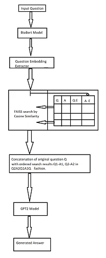
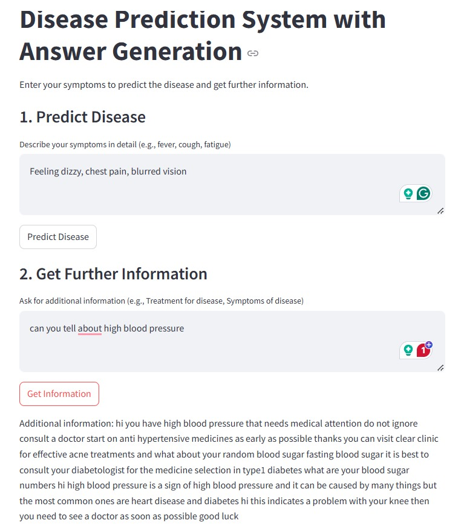

# MEDIMIND: NLP-Driven Tool for Disease Prediction and Question Answering in Healthcare

## Project Overview
**MEDIMIND** is an innovative NLP-driven tool designed to enhance disease prediction and question answering within the healthcare sector. By leveraging traditional NLP techniques along with state-of-the-art models like **BioBERT** and **GPT-2**, MEDIMIND processes and interprets unstructured medical texts, such as clinical notes and biomedical literature, to assist clinicians and patients.

## Key Features
- **Disease Prediction**: Utilizes NLP methods, including bigrams, trigrams, and Naive Bayes classifiers, to predict disease risks based on patient records.
- **LLM-Powered QA**: BioBERT and GPT-2 are fine-tuned on biomedical corpora to answer complex medical questions with high accuracy.
- **Risk Assessment**: Converts text-based records into structured representations for efficient disease risk evaluation.

## System Components
1. **Disease Prediction Module**: Applies traditional NLP techniques such as bigrams, trigrams, and Naive Bayes classifiers to analyze textual patterns for disease prediction.
2. **Question-Answering (QA) Module**: Leverages BioBERT and GPT-2 to answer medical questions, ensuring reliable answers to clinical inquiries.
3. **Integrated Pipeline**: Combines traditional methods with LLMs to provide an efficient, integrated solution for healthcare support.

## Achievements & Results
- **Disease Prediction**: The **Trigram TF-IDF** model achieved the highest accuracy of 96% disease prediction.
- **Question Answering**: BioBERT and GPT-2 models demonstrated high accuracy in answering medical questions.
- **Performance Metrics**:
  - **BioBERT Validation Accuracy**: 94%
  - **GPT-2 Validation Accuracy**: 76%
  - **ROUGE-L**: 0.74
  - **Perplexity**: 3
  - **BLEU Score**: 0.64
- **Impact**: Demonstrated how combining traditional NLP techniques with advanced LLMs can improve diagnostic accuracy, patient care, and clinical decision-making.

## Installation
1. Clone the repository:
   ```bash
   git clone https://github.com/yourusername/medimind.git

## Architecture


## UI

